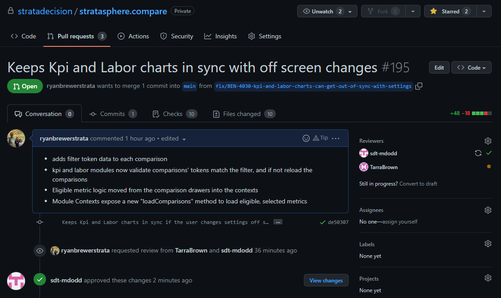
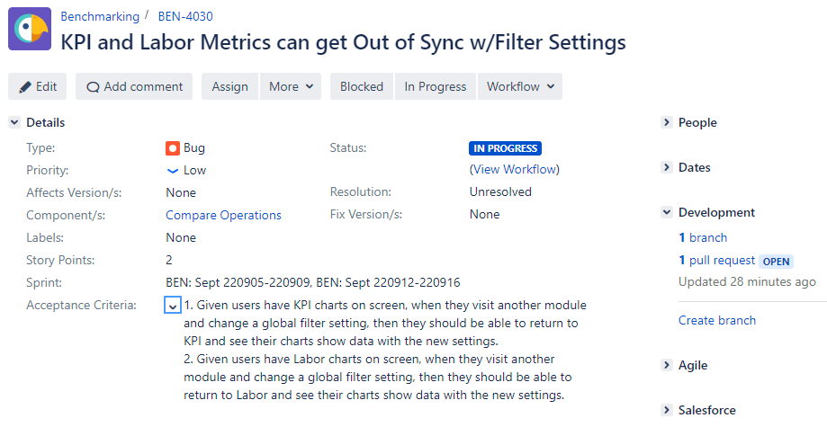

# Objective 3: Create a Highly Detailed Pull Request

As mentioned in the last objective, a `pull request (/PR)` is a formal request to make changes
to the main codebase (aka the `origin`).  There are often two parties involved in
pull requests: the contributor, and reviewer(s).

Contributors `make a PR`. However, they don't simply knock on the origin's door,
plunk down a phonebook of code, and skip off on their merry way.

The `contributor` solicits reviewers for their `pull request`,
and strives to make their contribution digestible via concise description,
and possibly screenshots.

Software projects often enumerate `coding standards`. The `reviewer` is responsible for
upholding these `standards`. This can be in terms of patterns, naming conventions, logic, etc.
Consistency is a prized attribute of maintainable software, and the `PR code review` is where
to keep it.

**In this walkthrough, we're going to:**
1. Checkout an existing, never-before-merged branch
2. Make a highly detailed PR
3. Solicit a reviewer
4. Discuss our code change
5. Put on our Reviewer hat and approve the change

## Prepare a Branch to PR

If you haven't already, clone the git gud repo so you have a copy on your machine.

1. Run `git clone git@github.com:ryanbrewerstrata/git-gud.git`
   * Not working? Try `git clone https://github.com/ryanbrewerstrata/git-gud.git`
   * Still not working? Breakout room.
2. Run `git checkout feature/objective-3-demo` 

