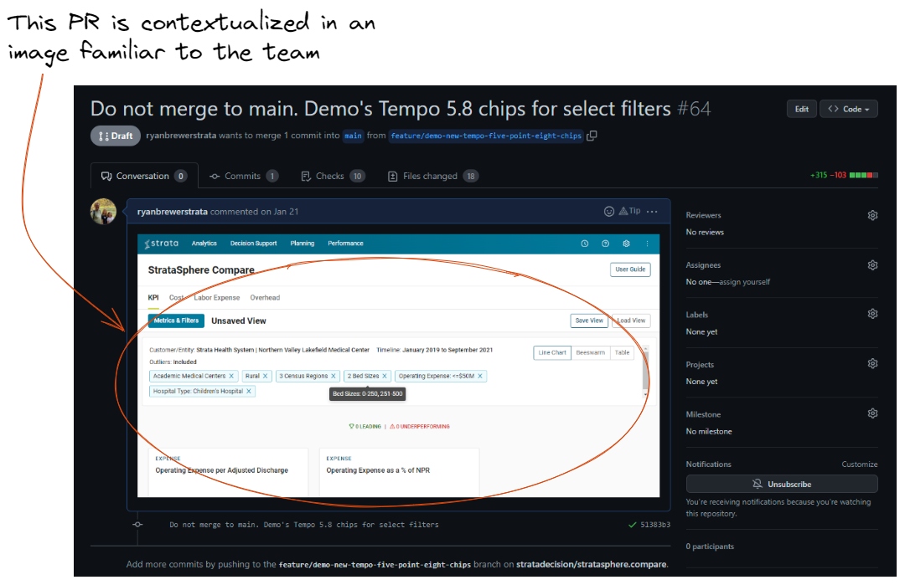
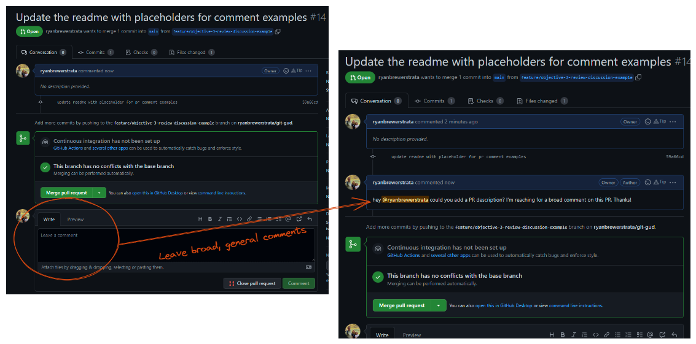
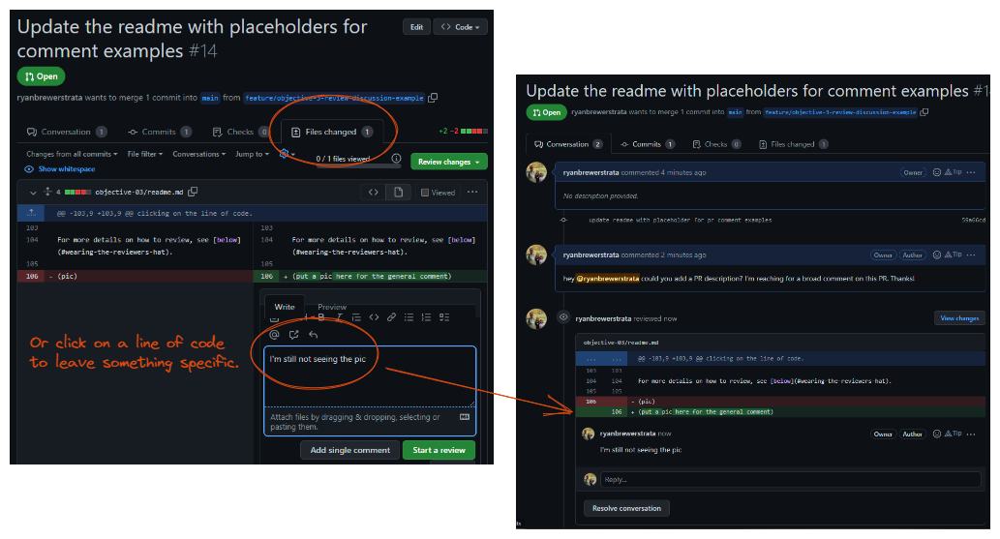
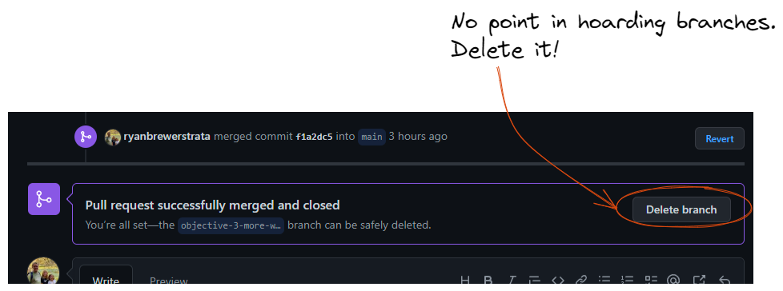

# Objective 3: Write a Pull Request that Won't Push Others Away

As mentioned in the last objective, a `pull request (/PR)` is a formal request to make changes
to the official codebase (aka the `origin`).  There are often two parties involved in
pull requests: the contributor, and reviewer(s).

Contributors `make a PR`. However, they don't simply knock on the origin's door,
plunk down a phonebook of code, shake their tired arms and walk away.

The `contributor` solicits reviewers for their `pull request`,
and strives to make their contribution digestible via concise description,
and possibly screenshots.

Software projects often enumerate `coding standards`. The `reviewer` is responsible for
upholding these `standards`. This can be in terms of patterns, naming conventions, logic, etc.
Consistency is a prized attribute of maintainable software, and the `PR code review` is where
this can be upheld.

## Describe PRs with Care
First impressions are a time-honored assessment strategy. Your PR's title and description
are its first impression, so make them with care! As an example, look at the following image.
It has several qualities that come together to make it slap.

This `pull request` aimed for a clear & concise `title`, and fired off bullet points
in the `description` to hit some specifics. Clear, brief comments help guide the reviewer
and make the project history (`git log`) easier to scan.

A picture might be even better!  You can add pics to your PR's description
straight from your clipboard, like in the 2nd screenshot below. ("Tempo 5.8 Chips".)

> **Neither a PR's title nor its description can link your work to Jira.** To link your pull request to Jira, you need
> a Jira Ticket ID to appear somewhere in the branch name.  See [Objective 2](../objective-02/readme.md#how-to-create-a-well-named-branch) for details.

**How to copy a screenshot to your clipboard**
* Windows: `win+shift+s` - crop a portion of your screen with your mouse
* Mac: `cmd+ctrl+shift+4` - crop a portion of your screen with your mouse

# Walk Through
> **Prerequisites** You'll need a strata GitHub account to complete the walk through.

**In this walk through we're going to:**
1. Fork Git-Gud and find a never-before-merged branch
2. Make a highly detailed PR
3. Solicit a reviewer
4. Discuss our code change
5. Put on our Reviewer hat and approve the change

## Prepare a Branch to PR
Fork the Git Gud repo.

## Find the Premade, Ready-To-PR Branch
1. From your fork's home page, click "branches".
2. Look for the `objective-3-demo` branch.
2. Click "New pull request" on the `objective-3-demo` branch

> For the sake of this demo, **we're going to pretend
> you created this branch, and are fully aware of the changes within it!**

## Write a Title and Description for the PR
Since we're only pretending you authored this branch, but are
asking you to title and describe the PR, you'll of course need
to unearth its purpose.

From your PR page on GitHub, scroll down to see the changes in this branch.

Now that you know what's changed, take a minute to think about
a clear but brief title for the change.  If you feel more details
would help, place those in the description block.

## Add a Reviewer
Select one or more reviewers.  This immediately sends each reviewer an email with a link to your PR and request for review.

> **Not getting reviews?** Remember, everyone is busy with their own work, but also emails are easily missed. Use your own discretion when deciding to remind someone of your PR.

## Code Review!
Your reviewers may immediately approve your code, or ask for more information.
They may also make suggestions.  There are two commenting features GitHub
provides for this process. Broad or generic comments can be left via the comment box at
the bottom of the Pull Request. Specific lines of code can be commented on by 
clicking on the line of code.

For more details on how to review, see [below](#wearing-the-reviewers-hat).

> If you just want to comment on a single line of code, click "Add a single comment".

> If you comment by clicking "Start a Review", GitHub expects you will be leaving
> many comments, and submitting them all at once.  It's a way to batch a bunch
> of notes together.  Click "Finish Review" to close your batch. **Comments in your "review"
> won't be visible to anyone until you Finish it!**

## Merge Your PR After Approval
Once your discussions have been resolved, and your code reviewers have given their approval,
you can merge your code.

Once merged, delete your branch from the origin. GitHub can be configured to do this automatically,
though you'll still need to delete your local branch manually.

# How to Review a PR

## Wearing the Reviewer's Hat

You'll inevitably be asked to review code,
whether you feel qualified or not.
Here are some helpful pointers for executing this responsibly.

1. **Protect your project's conventions.** Should SQL SELECT statements be one-liners? Are filenames kebab cased? No one likes a nitpick, but your team likely has some standards it wants to follow! A clean project is easier to maintain.
2. **Ask clarifying questions.** GitHub allows you to discuss the PR from a distance using the general comments box. However, you can also comment on specific lines of code simply by clicking them.
3. **Respect everyone's time.** You aren't expected to drop what you're doing and immediately review a PR. However, it's good not to make the author wait a half-week either! Just being mindful will go a long way.
4. **Respect everyone's ability.** Everyone is at a different stage in their career.  If you need to scribble red ink all over a PR, strive to do it in a way that promotes growth.
5. **What if you're not qualified?** Ask more questions, or possibly pass the baton to another reviewer.  Trusting your colleagues is also worth consideration, and you may decide some approvals don't require your complete understanding.

## Citations
* trust - old ci/cd guy frank, uncle bob?, 