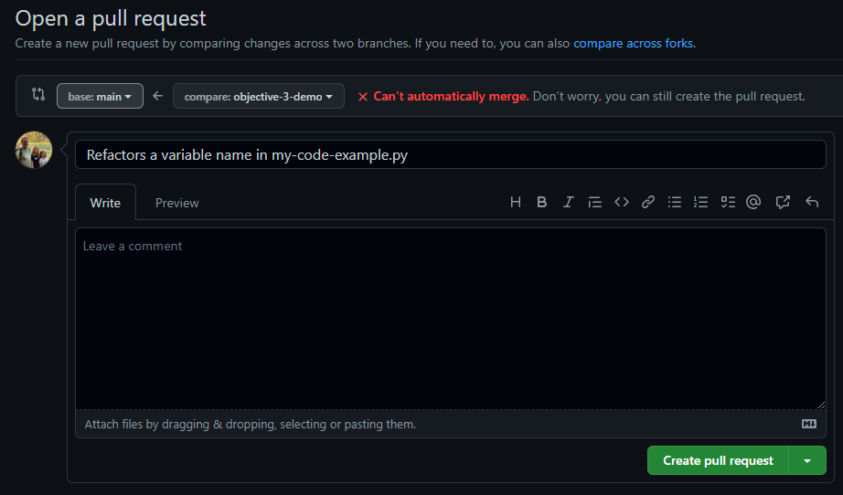
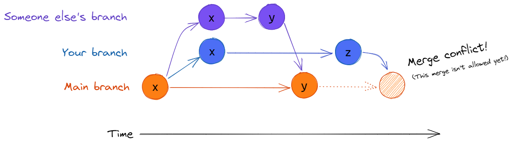
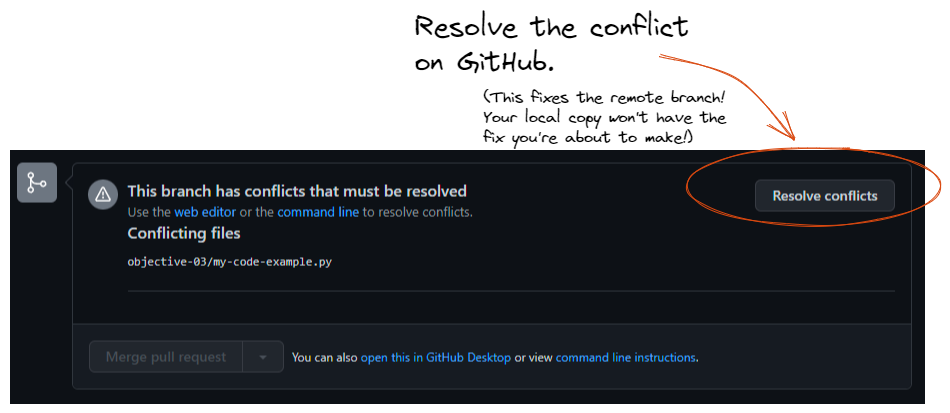

# Objective 4: Peacefully Resolve a Conflict on GitHub

> **Completion of Objective 3 is required.** This objective starts where that one ends.

## Learning of a Merge Conflict on GitHub
A merge conflict is noticeable from the moment you attempt to make a `pull request`.
The red warning about merging indicates a `merge conflict`. But what is this?

Git requires that everyone agrees on the past.
It does this by tracking how each branch begins and ends,
and compares beginnings.

That is to say if your branch has a line of code that began in main as "x",
and your `pr` attempts to change something **that is no longer "x"**,
your merge is put on hold and a `merge conflict` is raised.

## Resolving a Merge Conflict in GitHub

1. Click the Resolve Conflict button
2. For this demo, we're going to agree our line is the right line, and what is in Main can be overwritten. Delete the
arrows, divider, and old line so that the file looks like your initial change.

(pic of the conflict in the editor)

## More about our Resolution

Many conflicts aren't as trivial as this one. In some cases you'll consult with the author of the conflicting
code and decide together how best to move forward.  Additionally, there are more advanced tools than the one
demo'd today on GitHub.  Many IDEs, like PyCharm and VSCode have more tools to help you understand and fix a conflict.