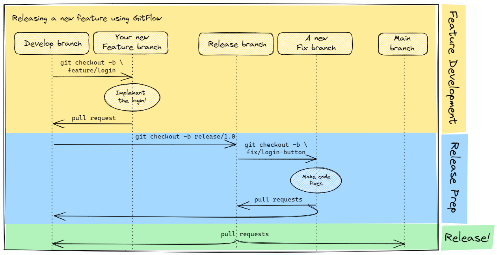

# Objective 6: GitFlow

An introduction to one technique for managing software development life cycles.

## What is GitFlow, in a Nutshell?

* GitFlow is a convention for continuously integrating features and fixes into a codebase
* The code running in production is mirrored by one branch, typically `main`
* New features and fixes are committed in another branch, typically `develop`
* Changes are released by creating a release branch off `develop`, then merging that into `main`
  * A deployment, if one exists, will coincide with this merge

## Why do some teams adopt GitFlow?

* Pros
  * Stability - new code changes are less likely to break things in prod
  * Clarity - branch naming conventions help others understand 
* Cons
  * More ritual around code changes
  
## Setting up your repo for GitFlow

1. Start with a `main` branch
2. From `main`, create a `develop` branch
3. Update the GitHub repo so that `develop` is the default branch. This will make it so all PRs default to going into `develop` instead of `main`.
   * github.com >> _your repo_ >> Settings >> Default Branch

## GitFlow conventions

GitFlow is nothing but a set of branching and merging conventions.
The most generic branch naming conventions follows a `prefix/description` nomenclature,
and distinguish features, bug fixes, normal releases, and hotfixes from each other.

> Note, Strata's teams have their own modifications. For example, Snowcats injects JIRA ticket numbers, etc (`fix/JAZZ-1234/cost-marts-inpatient-calculation`)

* `feature/some-description-of-this-feature` - new features going into the next scheduled release
* `fix/handy-but-short-description` - bug fixes going into the next scheduled release
* `hotfix/another-short-description` - unanticipated code releases, to fix something important
* `release/a-version-number-or-date` - a normal release branch.

## Example

1. Initially, the repository has the `main` and `develop` branches.
2. A developer creates a new branch called "feature/login" from the `develop` branch to implement a login feature.
3. The developer makes several commits to the "feature/login" branch, adding and modifying code related to the login functionality.
4. Once the feature is complete, the developer creates a pull request to merge the "feature/login" branch into the `develop` branch.
5. After code review and approval, the pull request is merged.

_The sprint continues, and steps 1-5 repeat as other features and bug fixes get merged into `develop`..._

_...until it's time to prepare for a code release--which may be a day or more away._

6. Another developer creates a "release/1.0" branch from the `develop` branch to prepare for a new release.
7. The developer makes necessary changes, bug fixes, and tests on the "release/1.0" branch.
8. Once the release is ready, the "release/1.0" branch is merged into both the `main` and `develop` branches.
9. If a critical issue arises in the production code, a hotfix branch like "hotfix/1.0.1" is created from the `main` branch.
10. The hotfix is implemented, and the branch is merged into both the `main` and `develop` branches.
